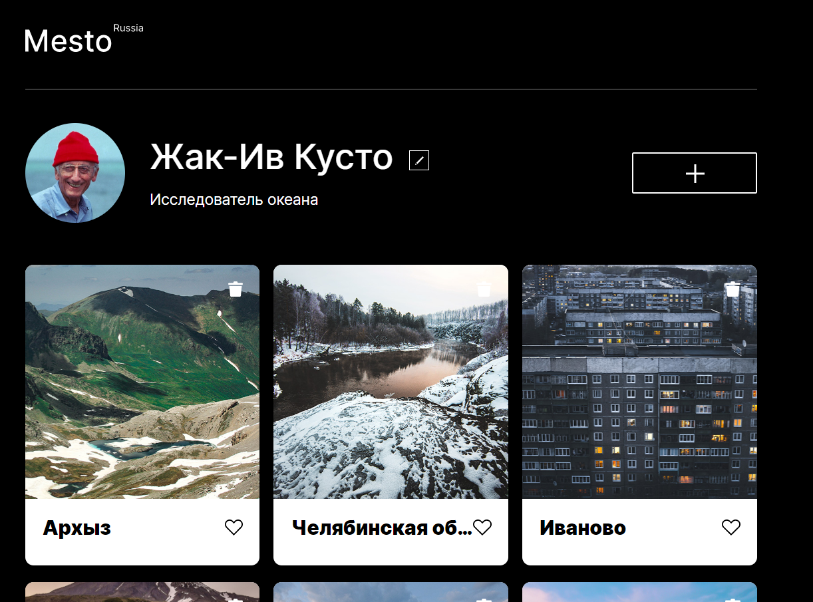

# Проект: Место

В данном проекте реализована адаптивная вёрстка. На странице присутствуют карточки с фотографиями. Все файлы распределены по БЭМ. Было применено `flex` позиционирование. С помощью **JavaScript** реализовано: редактирование профиля, добавление и удаление карточек, лайки и открытие картинки в увеличенном мастшабе.

### Обзор

* [Ссылка на сайт](https://karinayatimova.github.io/mesto/)

* [Ссылка на макет в Figma](https://www.figma.com/file/2cn9N9jSkmxD84oJik7xL7/JavaScript.-Sprint-4?node-id=0%3A1)

